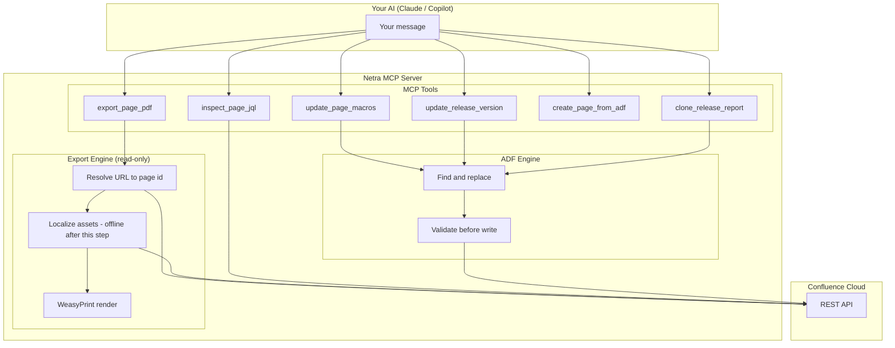

# Netra MCP Server - Confluence Write Tool

This tool lets your AI assistant (Claude, GitHub Copilot, or any MCP-compatible client) read and edit Confluence pages for you. You describe what to change in plain language, and the AI calls the right tool.

**What it can do:**
- Show you every JQL query on a Confluence page, extracted cleanly with its location
- Replace version tokens or JQL values across an entire page in one shot
- Preview every change before anything is written (dry-run is on by default)
- Clone a release report page to a new version with all macros updated
- Export any Confluence page to a PDF (rendered server-side, no page write involved)

---

## Before you start

You need:

- **Python 3.12 or newer** - check with `python --version`
- **uv** (Python package manager) - install from [docs.astral.sh/uv](https://docs.astral.sh/uv/getting-started/installation/)
- A **Confluence Cloud** account
- A **Confluence API token** - create one at: Atlassian account -> Security -> API tokens -> Create API token

---

## Setup (one time)

**1. Clone the repository**

```bash
git clone <repo-url>
cd netra-confluence-mcp
```

**2. Install dependencies**

```bash
uv sync
```

**3. Create your configuration file**

```bash
cp .env.example .env
```

Open `.env` and fill in your details:

```ini
CONFLUENCE_BASE_URL=https://your-org.atlassian.net
CONFLUENCE_API_TOKEN=your-api-token-here
CONFLUENCE_USER_EMAIL=your-email@example.com
CONFLUENCE_SITE_URL=https://your-org.atlassian.net
LOG_LEVEL=INFO
```

`CONFLUENCE_BASE_URL` and `CONFLUENCE_SITE_URL` are usually the same value.

**4. Test that it starts**

```bash
uv run python server.py
```

You should see the server start without errors. Press Ctrl+C to stop it - your AI client will start it automatically when needed.

---

## Connect your AI client

### Claude Desktop

1. Open your Claude Desktop config file:
   - **macOS:** `~/Library/Application Support/Claude/claude_desktop_config.json`
   - **Windows:** `%APPDATA%\Claude\claude_desktop_config.json`

2. Add this block (adjust the `cwd` path to where you cloned the repo):

```json
{
  "mcpServers": {
    "netra-confluence-writer": {
      "command": "uv",
      "args": ["run", "python", "server.py"],
      "cwd": "/absolute/path/to/netra-confluence-mcp"
    }
  }
}
```

3. Restart Claude Desktop. The Confluence tools will appear in the tool list.

### Claude Desktop over HTTP (mcp-remote bridge)

When the server runs in HTTP mode (Docker container, remote host, or `SERVER_TRANSPORT=http uv run python server.py`) instead of as a stdio child process, use [`mcp-remote`](https://www.npmjs.com/package/mcp-remote) as a stdio-to-HTTP bridge. Claude Desktop's JSON config only spawns stdio children, so the bridge translates between Claude Desktop and the running HTTP endpoint.

Install `mcp-remote` once:

```bash
npm install -g mcp-remote
```

Add to `claude_desktop_config.json`:

```json
{
  "mcpServers": {
    "netra-confluence-writer": {
      "command": "mcp-remote",
      "args": ["http://127.0.0.1:8765/mcp"]
    }
  }
}
```

Prefer no global install? Use `npx` instead:

```json
{
  "mcpServers": {
    "netra-confluence-writer": {
      "command": "npx",
      "args": ["-y", "mcp-remote", "http://127.0.0.1:8765/mcp"]
    }
  }
}
```

The Confluence tools appear in the tool list once the bridge connects to the running server. The server must already be listening at the URL in `args` (see [Production transport (http)](#production-transport-http)).

### VS Code with GitHub Copilot

1. Open your VS Code user settings (`Ctrl+Shift+P` -> "Open User Settings JSON")

2. Add:

```json
{
  "mcp": {
    "servers": {
      "netra-confluence-writer": {
        "command": "uv",
        "args": ["run", "python", "server.py"],
        "cwd": "/absolute/path/to/netra-confluence-mcp"
      }
    }
  }
}
```

3. Reload VS Code. The tools are available in Copilot Chat when you click the tools icon.

### Other MCP clients

Use `uv run python server.py` as the server command with the project directory as the working directory. By default the server uses stdio transport (a child process spawned per client) - the standard transport for local MCP clients.

---

## Production transport (http)

For cloud or shared deployment the server runs standalone as a web service instead of being spawned as a child process - one server process serves many clients over HTTP. Every tool call here is a single, independent read-transform-write against Confluence (there is no clarification loop or multi-turn session), so the server runs **stateless**: no session store, no Valkey, nothing to keep in memory between requests.

Start it in HTTP mode:

```bash
SERVER_TRANSPORT=http uv run python server.py
```

(Or set `SERVER_TRANSPORT=http` in `.env` instead.) `main()` in `server.py` reads the settings and passes `host`, `port`, and `stateless_http=True` directly to FastMCP's `run()` for this transport, starting uvicorn bound to `127.0.0.1:8765` by default. The `/mcp` path is FastMCP's default endpoint for the streamable HTTP protocol:

```
http://127.0.0.1:8765/mcp
```

To change the bind address or port, set `SERVER_HOST` / `SERVER_PORT` before starting (e.g. host `0.0.0.0` to accept connections from other machines). A `/health` endpoint is also exposed for load balancer / CF health checks:

```bash
curl http://127.0.0.1:8765/health   # {"status":"ok"}
```

`export_page_pdf`'s `delivery="link"` mode also exposes `GET /exports/{token}` - a time-limited download route for PDFs it has rendered (see [Recipe: export a page to PDF](#recipe-export-a-page-to-pdf)). It only serves tokens minted by that tool; there is no directory listing or arbitrary-path access.

Connect with the MCP Inspector (`npx @modelcontextprotocol/inspector`, transport "Streamable HTTP", URL `http://127.0.0.1:8765/mcp`), register it with Claude Code:

```bash
claude mcp add --transport http netra-confluence http://127.0.0.1:8765/mcp
```

or use `mcp-remote` as a stdio-to-HTTP bridge from Claude Desktop (see [Claude Desktop over HTTP](#claude-desktop-over-http-mcp-remote-bridge)).

**No endpoint auth yet.** There is no API-key gate on the `/mcp` endpoint itself (see Phase 4 in `docs/netra-mcp-confluence-write-phased-design.md`). Keep the default loopback bind (`127.0.0.1`) unless you are on a trusted network or sitting behind an auth-terminating proxy - see "Team access on http (multi-user credential passthrough)" below for why this matters even after per-user credentials are wired up.

### Team access on http (multi-user credential passthrough)

On http transport the server holds **no** Confluence identity of its own - `CONFLUENCE_API_TOKEN` / `CONFLUENCE_USER_EMAIL` must be left unset in the server's environment. Every tool call instead carries the caller's own identity as request headers:

```
X-Confluence-User-Email: alice@example.com
X-Confluence-Api-Token:  <alice's own API token>
```

The server builds a fresh Confluence client from those headers per call. Two teammates hitting the same shared server therefore write as themselves - Confluence page history shows "Alice" and "Bob", not a shared service account - and each person is bound by their own Confluence permissions. A request with no headers, or a blank header, gets `{"status": "ERROR", "error": "missing per-user Confluence credentials"}` - there is no fallback to a shared identity.

Each team member's Claude Desktop config carries their own headers via `mcp-remote --header`:

```json
{
  "mcpServers": {
    "netra-confluence-writer": {
      "command": "npx",
      "args": [
        "-y", "mcp-remote", "https://netra-confluence.<your-domain>/mcp",
        "--header", "X-Confluence-User-Email: alice@example.com",
        "--header", "X-Confluence-Api-Token: ${CONFLUENCE_API_TOKEN}"
      ],
      "env": { "CONFLUENCE_API_TOKEN": "<alice's own token>" }
    }
  }
}
```

(The `env` indirection keeps the raw token out of the JSON config body itself. Clients with native HTTP-header support can configure the two headers directly instead of going through `mcp-remote`.)

**Requirements for running this in production, not just locally:**
- **TLS end to end.** These headers carry a live API token; the route must be HTTPS-only. A plain-HTTP bind is only acceptable on `127.0.0.1`.
- **The endpoint still needs its own gate.** Header passthrough authenticates the *Confluence* call, not the *MCP endpoint* - anyone who can reach `/mcp` and supply any valid Atlassian token can use the server as an open Confluence proxy. Keep the route internal-only, or put an API-key/mTLS gate in front of it at the router, until OAuth 2.0 (Tier 2, see `docs/netra-mcp-confluence-write-phased-design.md` section 16.4) lands.
- **Don't log the headers.** `X-Confluence-Api-Token` must never end up in request logs. A structlog processor redacts any log field whose key matches `token`/`password`/`api_key`/`authorization` (case-insensitive) to `[REDACTED]` as a backstop, but no code should pass credential values to a log call in the first place.

If you don't need a shared server at all, per-user **stdio** (each teammate runs their own local process with their own `.env` - see [Setup](#setup-one-time)) already gives native per-user attribution today with zero extra configuration.

---

## Finding your Confluence page ID

The page ID is in the URL when you open a Confluence page:

```
https://your-org.atlassian.net/wiki/spaces/MYSPACE/pages/1234567890/Page+Title
                                                          ^^^^^^^^^^
                                                          this is your page ID
```

---

## Recipe: list all JQL queries on a page

Before you decide what to change, you can ask the AI to just show you what is on the page. This is read-only - nothing is written.

> "Show me all the JQL queries on Confluence page 34334."

The AI calls `inspect_page_jql("34334")` and returns:

```json
{
  "status": "INSPECTION",
  "page_id": "34334",
  "title": "R1.0 Release Report ProjectX",
  "jira_macro_count": 7,
  "jql_queries": [
    {
      "macro_id": "abc-123-...",
      "location_path": "table[0]/row[1]/cell[0]",
      "jql": "project = MYPROJ AND \"release status app1\" in (V1.0, V2.0) AND fixVersion = R1.0",
      "columns": "type,key,summary,status",
      "server": "MyJira",
      "max_issues": "20"
    },
    {
      "macro_id": "def-456-...",
      "location_path": "table[1]/row[0]/cell[0]",
      "jql": "project = MYPROJ AND label = app1_R1.0_Baseline AND fixVersion = R1.0",
      "columns": "type,key,summary",
      "server": "MyJira",
      "max_issues": "20"
    }
  ],
  "unique_strings": ["MYPROJ", "R1.0", "V1.0", "V2.0", "app1_R1.0", "app1_R1.0_Baseline"]
}
```

Key fields in the response:

- `status: "INSPECTION"` - always present; confirms this is the read-only path. No write happened.
- `jira_macro_count` - how many Jira macros the page has. If this is `0`, the page has no Jira macros and there is nothing to replace.
- `jql_queries[].jql` - the exact JQL string stored in each macro. Copy this verbatim if you plan to write a replacement rule - whitespace and quoting must match exactly.
- `jql_queries[].location_path` - human-readable ADF path so you know which macro you are looking at (`table[0]/row[1]/cell[0]`).
- `jql_queries[].macro_id` - the macro's UUID. Preserved on update, regenerated on clone.
- `unique_strings` - deduplicated token candidates already split on JQL syntax (whitespace, operators, quotes). Useful as a starting point to spot candidates, but **not** a direct replacement rule - it is a list of candidates, not the full substrings you would replace.

When to use this recipe:

- Before any update, to see what release tokens, project names, or version labels appear on the page.
- After an update, to verify the change landed where you expected.
- When you are handed an unfamiliar page and need to know what is on it before deciding what to do.

You can also pass a full Confluence URL instead of a bare page ID - the AI will extract the ID:

> "Show me the JQL on https://your-org.atlassian.net/wiki/spaces/ENG/pages/34334/R1.0-Report"

### Controlling the output format

The tool always returns the full JSON shape (with `status`, `page_id`, `title`, `jira_macro_count`, `jql_queries`, and `unique_strings`). The agent has the full response in its context but can choose to show you only the JQL strings. So:

| Your prompt | What the agent shows you |
|---|---|
| "Show me all the JQL queries on page 34334." | The full JSON dump (default behavior, what we documented in the recipe above) |
| "List just the JQL strings on page 34334." | A plain list of only the `jql` field values |
| "Show me the JQL queries on page 34334 as a bullet list." | One bullet per JQL, no metadata |
| "Show me only the JQLs and nothing else from page 34334." | Same as above, with explicit instruction to suppress the rest |
| "Give me a markdown table of the JQL queries on page 34334." | A formatted table - the agent can decide which columns to include |

A competent MCP client (Claude, Rovo) will honor all of these. The user always sees what they asked for.

---

## Worked example: change version V10.0 to V20.0

Say you have a release report page at page ID `2811939182` and every JQL query on it references `V10.0`. Here is how to update the whole page in three steps.

### Step 1 - Inspect the page

Ask your AI:

> "What JQL queries are on Confluence page 2811939182?"

The AI calls `inspect_page_jql` and returns something like:

```json
{
  "status": "INSPECTION",
  "page_id": "2811939182",
  "title": "V10.0 Release Report",
  "jira_macro_count": 12,
  "jql_queries": [
    {
      "macro_id": "abc-001",
      "location_path": "table[0]/row[1]/cell[2]",
      "jql": "project = MYPROJ AND fixVersion = ver_V10.0 AND status != Done",
      "columns": "key,summary,status"
    }
  ],
  "unique_strings": ["Done", "MYPROJ", "ver_V10.0", "ver_V10.0_Baseline", "V10.0"]
}
```

Look at `unique_strings` - these are the values you can replace. You can see `ver_V10.0_Baseline`, `ver_V10.0`, and `V10.0` all need to change.

### Step 2 - Preview the changes (dry run)

Ask your AI:

> "Preview replacing V10.0 with V20.0 on page 2811939182. Include label variants."

The AI calls `update_release_version` in dry-run mode:

```json
{
  "status": "DRY_RUN",
  "current_title": "V10.0 Release Report",
  "new_title": "V20.0 Release Report",
  "current_version": 14,
  "total_changes": 47,
  "change_summary": "jql: 36 changes\ntext: 8 changes\ntitle: 3 changes",
  "change_log": [...],
  "message": "Preview only. Call again with dry_run=False to apply."
}
```

Nothing was written yet. You can see exactly what would change.

### Step 3 - Apply the changes

If the preview looks correct, ask your AI:

> "Apply it."

The AI calls the same tool with `dry_run=False`:

```json
{
  "status": "UPDATED",
  "page_id": "2811939182",
  "title": "V20.0 Release Report",
  "version": 15,
  "url": "https://your-org.atlassian.net/wiki/spaces/MYSPACE/pages/2811939182",
  "total_changes": 47
}
```

Your Confluence page is now updated. Open the URL to verify.

---

## Other things you can do

### Replace a specific JQL value only

If you only want to change values inside JQL queries and not text or title:

> "Replace OLD_VALUE with NEW_VALUE in JQL queries only on page 99887766."

This uses `scope="jql"` which is precise - it will not touch column header names or other macro parameters even if they contain the same string.

### Clone a page to a new release

> "Clone page 2811939182 from version V10.0 to V20.0 with delivery date 2026-09-15. Create it as a draft."

The AI calls `clone_release_report`. The clone gets:
- All version tokens updated
- All Jira macro UUIDs regenerated (so the clone has no ID collisions with the original)
- All date nodes updated to the new delivery date

### Create a page from scratch

> "Create a new Confluence page in space MYSPACE titled 'Project Plan' using this ADF body: {...}"

---

## Recipe: export a page to PDF

`export_page_pdf` renders any Confluence page to a PDF from Confluence's own `export_view` HTML - Jira macros come out as static tables, no headless browser involved. It is **fully read-only**: no page, attachment, or metadata write ever occurs, so there is no dry-run/apply split like the write tools above - the AI can just do it.

### Step 1 - Ask for the export

> "Export Confluence page 2811939182 to a PDF."

You can give it a bare page ID (like above) or paste the full URL from your browser's address bar - any of these work:

```
2811939182
https://your-org.atlassian.net/wiki/spaces/ENG/pages/2811939182/Release+Report
https://your-org.atlassian.net/pages/viewpage.action?pageId=2811939182
https://your-org.atlassian.net/wiki/x/AbCdE                        (tiny link)
https://your-org.atlassian.net/wiki/display/ENG/Release+Report     (display URL)
```

The AI calls `export_page_pdf("2811939182")`. By default you get back a time-limited download link:

```json
{
  "status": "OK",
  "page_id": "2811939182",
  "page_title": "R1.0 Release Report",
  "page_version": 15,
  "pdf_sha256": "a1b2c3...",
  "pdf_bytes": 812345,
  "delivery": "link",
  "download_url": "https://netra-confluence.<your-domain>/exports/AbC123...",
  "expires_at": "2026-07-02T18:30:00Z",
  "asset_report": {"fetched": ["..."], "skipped_external": [], "failed": [], "downscaled": []},
  "message": "PDF ready: https://.../exports/AbC123... (expires 2026-07-02T18:30:00Z). Open the link in a browser to download it."
}
```

### Step 2 - Open the download link

Copy `download_url` (the AI's chat response will normally show it to you directly - the `message` field is written so the AI repeats it in prose) and open it in any browser, or `curl -O`/`wget` it. That triggers a file download (`Content-Disposition: attachment`), not an inline PDF preview in the tab.

The link only works until `expires_at` (30 minutes by default). If you wait too long, opening it returns "link expired - re-run the export" - just ask the AI to export the page again.

`asset_report` tells you about any images that didn't make it into the PDF unchanged: images hosted elsewhere are swapped for a placeholder and listed under `skipped_external`; a single broken image (403/404/timeout) degrades to a placeholder under `failed` instead of failing your whole export.

### Getting the PDF bytes directly instead of a link

If you'd rather have the AI hand you the file content directly (useful when you're not going to open a browser, e.g. scripting against the MCP client), ask for inline delivery:

> "Export page 2811939182 to a PDF, inline."

> Tool call: `export_page_pdf("2811939182", delivery="inline")`

This returns `pdf_base64` instead of `download_url`, but only when the PDF is small enough (under `EXPORT_INLINE_MAX_BYTES`, 4 MB by default). Bigger PDFs come back with `status: "ERROR"` and `error_code: "TOO_LARGE_FOR_INLINE"` - fall back to the default `delivery="link"` for those. Whether your MCP client can actually save a base64 blob to disk depends on the client, which is exactly why `"link"` is the default.

### Other options

- `page_size="LETTER"` for US Letter paper instead of the default A4:
  > "Export page 2811939182 to a PDF, US Letter size."
- `filename="quarterly-summary"` to control the downloaded file's name (defaults to the slugified page title plus today's date, e.g. `r1-0-release-report-2026-07-02.pdf`):
  > "Export page 2811939182 to a PDF and name it quarterly-summary."

### If it fails

`status` is `"ERROR"` and `error_code` explains why:

| `error_code` | What happened | What to do |
|---|---|---|
| `INVALID_URL` | The link/ID didn't match any accepted shape | Paste the page URL exactly as it appears in your browser, or use the bare numeric page ID |
| `WRONG_SITE` | The link points at a different site than this server is configured for | Only links on your own `CONFLUENCE_SITE_URL` are accepted, by design |
| `PAGE_NOT_FOUND` | The page doesn't exist, or was deleted/archived | Double-check the page ID |
| `PERMISSION_DENIED` | You (or the shared service account) can't view the page | You need at least View permission in Confluence |
| `PAGE_TOO_LARGE` | The page's rendered HTML exceeds the size guard | Very large pages aren't supported yet; try exporting a smaller page or section |
| `EXPORT_TIMEOUT` | Fetching, localizing images, and rendering together took too long | Usually transient - try again; persistent timeouts suggest a very large/complex page |
| `TOO_LARGE_FOR_INLINE` | You asked for `delivery="inline"` but the PDF is too big | Use the default `delivery="link"` instead |
| `STORAGE_FAILED` | The server couldn't hold the rendered PDF for link delivery | Try `delivery="inline"` for smaller PDFs, or re-run the export |
| `RATE_LIMITED` | Confluence itself rate-limited the request | Wait a bit and try again |
| `API_ERROR` | Any other Confluence/network error | Check the `message` field for details |

### How the download link works (good to know)

**Download links only work in `http` transport, single instance.** The link points at this server's own `/exports/{token}` route, which reads from an in-process cache (`EXPORT_STORE=memory`, the only backend shipped so far). That cache lives in one process's memory, so it only works with `instances: 1` in `manifest.yml.template` - the server logs a startup warning if it detects `CF_INSTANCE_INDEX` indicating more than one instance is running. Links expire after `EXPORT_LINK_TTL_SECONDS` (default 30 minutes, echoed in `expires_at`); an expired or unknown token gets `410 Gone` from the route, not a stack trace. If you only run the server as a local stdio process for yourself, `delivery="inline"` avoids the link mechanism entirely for small PDFs.

---

## How it works



The server reads pages as ADF (Atlassian Document Format - the native JSON format Confluence uses internally). It finds JQL values at their exact JSON path, replaces them, validates the result, and writes back. No regex is used at any point.

---

## Tool reference

| Tool | What it does | Writes? |
|---|---|---|
| `inspect_page_jql` | Lists all Jira macro JQL queries on a page with location paths | Never |
| `update_page_macros` | Replaces values in macro parameters on any page | Yes, if `dry_run=False` |
| `update_release_version` | Like above, also updates date node timestamps | Yes, if `dry_run=False` |
| `clone_release_report` | Clones a page, updates all version tokens and macro IDs | Yes, if `dry_run=False` |
| `create_page_from_adf` | Creates a new page from an ADF body | Yes, if `dry_run=False` |
| `export_page_pdf` | Renders any page to a PDF (download link or inline base64) | Never |

All write tools default to `dry_run=True`. You must explicitly say "apply it" or pass `dry_run=False` to make any change.

### Response status values

| Status | Meaning |
|---|---|
| `INSPECTION` | Read-only result; `jql_queries` and `unique_strings` present |
| `DRY_RUN` | Preview only; nothing written; `change_log` present |
| `UPDATED` | Page updated; `version` and `url` present |
| `CREATED` | New page created; `page_id` and `url` present |
| `NO_CHANGES` | No occurrences of the search term were found |
| `VALIDATION_FAILED` | ADF structure check failed; write blocked; `errors` list present |
| `VERSION_CONFLICT` | Someone else edited the page at the same time; retry |
| `ERROR` | API or network error; `error` field has details |

`export_page_pdf` uses its own response contract instead (`status: "OK" | "ERROR"` plus a typed `error_code` on failure) - see [Recipe: export a page to PDF](#recipe-export-a-page-to-pdf).

---

## Troubleshooting

**"Missing required fields" or 401 error**
Check your `.env` file. Make sure `CONFLUENCE_USER_EMAIL` matches the email on your Atlassian account, and `CONFLUENCE_API_TOKEN` is a valid token (not your password).

**"Page not found" (404)**
Double-check the page ID from the URL. The ID is the number in `.../pages/1234567890/...`.

**"Permission denied" (403)**
Your account needs at least View permission on the page to inspect it, and Edit permission to update it.

**The server is not appearing in my AI client**
Make sure the `cwd` path in your client config is the absolute path to the folder containing `server.py`. On Windows use forward slashes or escape backslashes.

**"Version conflict" after applying**
Someone else saved the page between your inspect and your apply. Just repeat the operation - the server re-reads the latest version before writing.

**PDF download link says "link expired - re-run the export"**
Download links expire after `EXPORT_LINK_TTL_SECONDS` (30 minutes by default) and aren't renewable - just ask the AI to run `export_page_pdf` again for a fresh link.

**PDF download link 404s even though `expires_at` hasn't passed yet**
The link only works against the single server instance that rendered it (`EXPORT_STORE=memory`). If the deployment is scaled to more than one instance, the download can land on a different one. Check the server logs for an `export_store_memory_scale_out_risk` warning at startup; the fix today is to keep `instances: 1` in `manifest.yml.template`.

**Images are missing or replaced with a text placeholder in the exported PDF**
That's the export's fidelity-gap disclosure working as intended, not a bug - check the `asset_report` field in the tool response. Images hosted outside your Confluence site are never fetched (`skipped_external`); a broken or restricted image (403/404/timeout) also degrades to a placeholder (`failed`) instead of failing the whole export.

---

## Docker and cloud deployment

The server ships as a self-contained, stateless Docker image - no Valkey, no external datastore. Full runbook (CF first deploy, blue-green updates, env var reference): `docs/docker_cf_deployment.md`.

`manifest.yml.template` allocates 512 MB (raised from 256 MB) - WeasyPrint's PDF rendering for `export_page_pdf` spikes well beyond the httpx-only baseline on large pages. The image also needs Pango/Cairo/GDK-Pixbuf/HarfBuzz and Noto fonts (CJK + emoji, so exported text doesn't render as tofu boxes); these are already baked into `docker/Dockerfile`.

### Local dev with docker-compose

```bash
# From repo root (never from docker/)
docker-compose up
curl http://localhost:8765/health   # {"status":"ok"}
curl http://localhost:8765/mcp      # MCP endpoint
```

### Build the image locally (single arch, fast)

Requires Docker Desktop 4.x+ with buildx (shipped by default).

```bash
bash scripts/docker-build-local.sh
docker run -p 8765:8765 --env-file .env ghcr.io/sunishbharat/netra-confluence-mcp:dev
```

### Build and push multi-platform (amd64 + arm64) and deploy to CF

```bash
docker buildx create --name multiarch --driver docker-container --use   # one-time
docker buildx inspect --bootstrap

export REGISTRY=ghcr.io/sunishbharat
./scripts/cf-deploy.sh   # builds both platforms, pushes to GHCR, then cf push
```

Set Confluence credentials as CF secrets once (they survive `cf push`/`cf restage`):

```bash
cf set-env netra-confluence-mcp CONFLUENCE_BASE_URL https://your-org.atlassian.net
cf set-env netra-confluence-mcp CONFLUENCE_SITE_URL https://your-org.atlassian.net
cf set-env netra-confluence-mcp CONFLUENCE_USER_EMAIL service-account@example.com
cf set-env netra-confluence-mcp CONFLUENCE_API_TOKEN <token>
cf restage netra-confluence-mcp
```

CI builds and pushes a multi-arch image to GHCR automatically on every `v*.*.*` tag push (`.github/workflows/docker.yml`).

---

## Running tests

Unit tests (no Confluence connection required):

```bash
uv run python -m pytest
```

Integration tests against a real Confluence page:

```bash
CONFLUENCE_TEST_PAGE_ID=<page-id> uv run python -m pytest -m integration
```

---

## Development commands

```bash
uv sync                                                    # install all deps
uv run ruff check .                                        # lint
uv run ruff format --check .                               # format check
uv run mypy --strict .                                     # type check
uv run python -m pytest --cov=confluence --cov-report=term-missing
```
